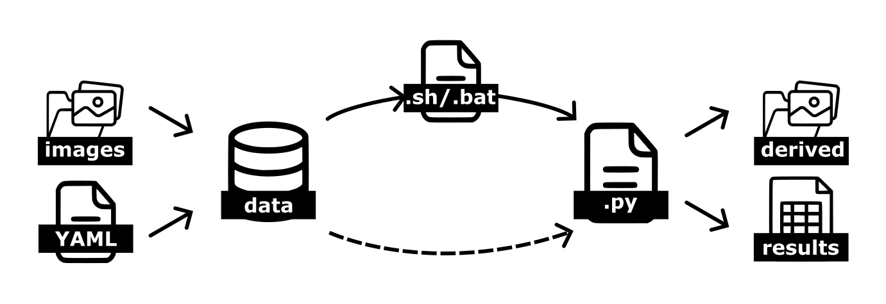

How to use
==========
Here we illustrate how to use the project's workflows and provide information about the models. 

.. ~~~~~~~~~~~~~~~~~~~~~~~~~~~~~~~~~~~~~~~~~~~~~~~~~~~~~~~~~~~~

Working with the project
------------------------
The two main input components are the ``images`` (stored in ``data/``) and the configuration ``YAML`` file (stored in ``configs/``), which are taken together and can then be precessed in two ways: either by using the provided bash scripts (``.sh``) in ``workflows/`` which is turn call the various Python scripts, or by providing the necessary parameters to the Python ``.py`` scripts directly. 

There are two sets of parameters: 

    - **Running parameters:** these are basically the input and output folders location for the raw data, as well as the derived data and results and model names. They are specified either in the workflows  scripts (``.sh`` or ``.bat``) or can passed directly to the Python ``.py`` scripts as arguments, see :ref:`files/workflow_models:Workflow files`. 
    - **Project parameters:** these are specific to each dataset, and contain project-specific parameters like image resolution, format, px/mm conversion rates and so on. These parameters are specified in the configuration ``YAML`` file, stored in ``configs/``, see :ref:`files/configuration:Configuration`. 

.. ~~~~~~~~~~~~~~~~~~~~~~~~~~~~~~~~~~~~~~~~~~~~~~~~~~~~~~~~~~~~

Workflow files
______________
In the ``workflows/`` folder, there are files written in bash (``.sh``) or batch (``.bat``) that can be used to run one or more modules in a pipeline. These files are nothing else that a chain of python calls the flow of the processing pipeline. 

    .. hint:: 
        If you are running on Linux or Mac OS, run the bash scripts (``.sh``), if you are running on Windows, use the batch scripts (``.bat``)! 

To run any of these scripts, in a terminal simply type the name (or path to) the ``.sh`` or ``.bat``  script and press Enter. 

    .. .. note:: 
    ..     **TODO**: transfer those bash scripts to renku workflows, so that the renku can track the dependencies and the inputs and outputs of each step, and generate the graph of the workflow.

The **running parameters** (e.g. input and output folders) are declared in these files, and, together with the project parameters in the configuration file, they govern the execution of the Python scripts. 

For example: 

.. code-block:: bash

    ROOT_DIR="example/path/to/your/root_dir"
    MODEL_C="convnext-small-v0"
    MODEL_S="mit-b2-v0"

    python scripts/image_parsing/main_raw_to_clips.py \
        --input_dir=${ROOT_DIR}/data/mzb_example_data/raw_img/ \
        --output_dir=${ROOT_DIR}/data/mzb_example_data/derived/blobs/ \
        --save_full_mask_dir=${ROOT_DIR}/data/mzb_example_data/derived/full_image_masks_test \
        --config_file=${ROOT_DIR}/configs/configuration_flume_datasets.yaml \
        -v

⚠️ WARNING: this code will *not* work if copy-pasted in the terminal! 

The extract above from ``workflows/full_pipeline_custom.sh`` will run the script ``scripts/image_parsing/main_raw_to_clips.py``, passing it various global parameters: 

 - ``ROOT_DIR`` is the the root directory fo the project; this is important to anchor all the relative path references that modules make; 
 - ``MODEL_C`` is the name of the DL model to be used for classification, see list of models :ref:`files/project_structure:Models`; 
 - ``MODEL_S`` is the name of the DL model to be used for skeletonization. 

Then, the command ``python`` is invoked followed by the script to be executed, and the parameters required by that script, in this case: 

 - ``--input_dir`` where the raw images are stored
 - ``--output_dir`` where the outputs should be saved
 - ``--save_full_mask_dir`` where the full images with segmented masks should be saved
 - ``--config_file`` the location of the project configuration file (for more details see :ref:`files/configuration:Configuration`)
 - ``-v`` flag for verbose, printing out more details

Not all parameters declared are used in the extract above, however they are necessary for other calls in the same scripts; please also note that different scripts will require different input parameters, whereas the parameters contained in the configuration file are tied to the project and independent from the scripts. 

.. ~~~~~~~~~~~~~~~~~~~~~~~~~~~~~~~~~~~~~~~~~~~~~~~~~~~~~~~~~~~~

Interactive session
___________________
Instead of running the scripts using the workflow illustrated above, users can run directly the Python files in an interactive session (e.g. Jupyter notebook). Note that in this case the running parameters must be supplied as variables either in the interactive session or directly in the script. 

To launch a script in interactive session simply open it in a Jupyter notebook and set ``__name__ = '__main__'`` in your session. The code can then be run block-by-block and will print results to terminal; you can read more on ``__main__`` functions `here <https://docs.python.org/3/library/__main__.html>`__. 

Please note that the correct ``conda`` must be active for running the scripts. The full python environment is provided in ``environment.yml`` (see :ref:`files/installing:Install libraries locally`). 

.. ~~~~~~~~~~~~~~~~~~~~~~~~~~~~~~~~~~~~~~~~~~~~~~~~~~~~~~~~~~~~

Import as module
________________
Finally, users can import this repo as a package and make use of its functions in their own scripts. 
Make sure the package is installed (see :ref:`files/installing:Install libraries locally` in case of doubt), and simply use ``import mzbsuite`` in your scripts. 

