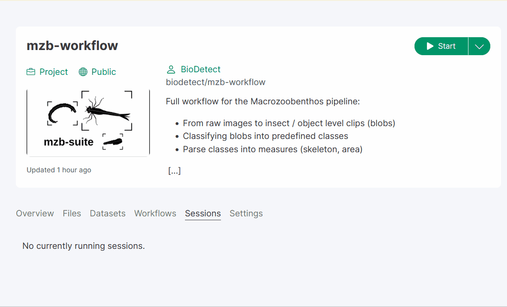
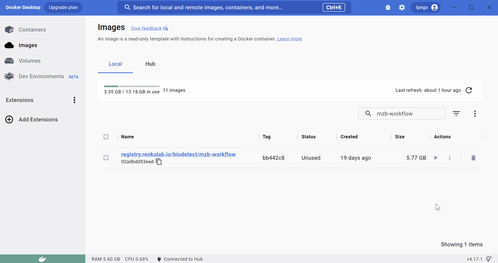

Installation
============

There are a few ways to work with the project: 

    #. Run it in an `Online session on RenkuLab`_ (easiest setup, but limited computing power and non-permanent storage!)
    #. Run it on your local machine using a `Docker container`_ (recommended for novice users)
    #. `Install libraries locally`_ directly on your computer (advanced users, troubleshooting potentially needed)

.. ~~~~~~~~~~~~~~~~~~~~~~~~~~~~~~~~~~~~~~~~~~~~~~~~~~~~~~~~~~~~

Online session on RenkuLab
---------------------------
To try out ``mzbsuite``, the quickest way to is to spin a virtual session on Renkulab: 

#. Go to `<https://renkulab.io/>`__ and create an account (or log in if you already have one). 
#. Once you're logged in, go to `<https://renkulab.io/projects/biodetect/mzb-workflow>`__ 
#. Start the virtual session: 

    #. in the project overview you should see a green play button
    #. click the dorp-down menu arrow on its right and select "Start with options"; 
    #. Under "Session class" select Large (1 CPU, 4 GB RAM, 64 GB disk)
    #. Drag the bar for "Amount of storage" to 10 GB. 
    #. Toggle the switch "Automatically fetch LFS data"
    #. At the bottom of the page click "Start session"
    #. Be patient! It can take several minutes for the session to start. 

Once the session has started you should drop directly into the JupyterLab interface. 
From there you can run the example workflow by simply typing: 

    .. code-block:: bash

        workflows/mzb_example_full_pipeline.sh

You can also upload your own images and test `mzb-suite` on them! Simply create a new folder under ``/data`` and change the input / output directories in the ``workflows/mzb_example_full_pipeline.sh`` script accordingly (see :ref:`files/how_to_use:Workflow scripts` for more details). 

    .. admonition:: \ \ 
        
        We don't recommend Renku online sessions for long term use, because they have limited computing power and storage and can be shut down (i.e. for maintenance), therefore all data not exported will be lost! 

.. ~~~~~~~~~~~~~~~~~~~~~~~~~~~~~~~~~~~~~~~~~~~~~~~~~~~~~~~~~~~~

Docker container
----------------
If you want to run the pipeline on yur own data and local computer resources but you are not too familiar with managing python environments, we recommend installing via Docker. 

#. First, install the `Docker Engine <https://docs.docker.com/get-docker/>`__ 

    .. admonition:: \ \ 

        Admin privileges may be needed to install Docker Engine. 
        Additionally, on some systems, it might be necessary to enable virtualization in the BIOS. How to do this depends on the specifics of your system: look online for a guide specific for your computer manufacturer / model. 

#. After the installation, launch the Docker app and wait until it's *fully* started. 

#. Open a terminal in a directory you would like to save your work in (you must have write permissions). 

    .. hint:: 

        If you don't know how to open a terminal, instructions for `Windows <https://superuser.com/a/340051>`__ and `Mac <https://support.apple.com/guide/terminal/open-new-terminal-windows-and-tabs-trmlb20c7888/mac>`__. 

#. Download and launch the project's Docker image by running the following lines in a terminal window: 

    ⚠️ WARNING: this may take a while to run the first time, as it needs to download the Docker image (~5 GB)

    .. code-block:: bash 
        
        imageName=registry.renkulab.io/biodetect/mzb-workflow:8805a38
        repoName=mzb-workflow
        docker run --rm -ti -v ${PWD}:/work/${repoName} --workdir /work/${repoName} -p 8888:8888 ${imageName} jupyter lab --ip=0.0.0.0

    .. hint:: 
        If you are on Windows, use this instead: 
        
        .. code-block:: console
            
            set imageName=registry.renkulab.io/biodetect/mzb-workflow:8805a38
            set repoName=mzb-workflow
            docker run --rm -ti -v %cd%:/work/%repoName% --workdir /work/%repoName% -p 8888:8888 %imageName% jupyter lab --ip=0.0.0.0
    
#. The last few lines of the output should look something like this: 

    .. code-block:: console

        To access the server, open this file in a browser:
            file:///home/jovyan/.local/share/jupyter/runtime/jpserver-14-open.html
        Or copy and paste one of these URLs:
            http://a62c488a6f4c:8888/lab?token=2fb162adc7251f04e37cb8d6f1f55db2fbdbc7d2e1d9e1e8
            http://127.0.0.1:8888/lab?token=2fb162adc7251f04e37cb8d6f1f55db2fbdbc7d2e1d9e1e8

#. We highly recommend using an IDE like `Visual Studio Code <https://code.visualstudio.com/>`__ to access the Docker container. 
    
    - Once you have VS Code installed (follow link above), you can install the `VS Code Docker extension <https://code.visualstudio.com/docs/containers/overview>`__. 
    - If your container is already started, you can attach VS Code to it by opening the Docker extension side panel and right-clicking the container, then select "Attach VS Code to runnning container". 
    - You will be dropped in the container's terminal and will have access to the volume (i.e. the local folder on your computer with the data) mounted on it. 

#. Alternatively, you can also directly copy-paste the URL address starting with ``http://127.0.0.1`` into your browser (e.g. Firefox, Chrome), hit Enter, and you should drop into a JupyterLab interface. 

Launching the Docker image
__________________________
The procedure is the same when starting the Docker image the following times, except it will not download it again therefore should be much faster launching it. Please not that the ``base`` environment (activated by default) in the Docker container already contains all required dependencies, so you don't need to activate it using ``mamba``. 

If you prefer to use VS Code to access your container (recommended), you can also use a simplified ``docker run`` command, but remember to attach the local path where you mzb-workflow is located; like so: 

.. code-block:: bash
    docker run -v path\to\your\local\mzb-workflow:/home/jovyan/work/mzb-workflow

The animation below shows the procedure to launch the container from Docker Desktop, and attach VS Code to it (requires the image to already have been downloaded). 

.. hint:: 
    Read more about Docker containers in `VS Code Docker extension <https://code.visualstudio.com/docs/containers/overview>`__ and `working with containers <https://code.visualstudio.com/docs/devcontainers/containers>`__. 

.. hint:: 
    If you have a CUDA-capable GPU, using its resources in Docker requires additional configuration, see `NVidia container toolkit <https://github.com/NVIDIA/nvidia-container-toolkit>`__. 

Using the most up-to-date Docker image
______________________________________
The Docker image provided above saved as variable ``imageName`` is a manually pinned image that we tested and we know works. It might not contain the most most up to date versions of scripts, especially if we pushed changes to the repo recently. If you want to pull the most updated Docker image, please follow instructions `here <https://renku.readthedocs.io/en/stable/how-to-guides/own_machine/reusing-docker-images.html>`__. 

.. admonition:: \ \ 

    Make sure that the Docker image is correctly built before pulling it; you can check build status `here <https://gitlab.renkulab.io/biodetect/mzb-workflow/-/pipelines>`__. 

.. ~~~~~~~~~~~~~~~~~~~~~~~~~~~~~~~~~~~~~~~~~~~~~~~~~~~~~~~~~~~~

Install libraries locally
-------------------------
If you prefer to install the project directly in your local environment or just want to use the functions in your own scripts, you can download the repo and install it as a Python package. 
The project is hosted on the `Swiss Data Science Center <https://datascience.ch>`__ GitLab server, you can find the repository here: 

    .. rst-class:: center

    `<https://gitlab.renkulab.io/biodetect/mzb-workflow>`__. 

To download the project, you simply need to clone it into a location of your choice: 

.. code-block:: bash

    git clone https://gitlab.renkulab.io/biodetect/mzb-workflow.git

.. admonition:: \ \ 
   
   If you don't have Git installed, you can follow instructions `here <https://git-scm.com/downloads>`__. We recommend using Git because it allows you to easily update the package, and to track any changes you make to the source code. 

This will create a folder called ``mzb-workflow`` in the current working directory. 

.. hint:: \ \ 
   If you don't want to use Git, you can directly download an archive of the `repository <https://renkulab.io/gitlab/biodetect/mzb-workflow>`__ from GitLab and extract it manually. 

You can then install the necessary packages using the a package manager like `mamba <https://github.com/conda-forge/miniforge>`__ or `conda <https://conda.io/projects/conda/en/latest/user-guide/install/index.html>`__, using the ``environment.yml`` file: 

.. code-block:: bash

    cd mzb-workflow    # chdir mzb-workflow in Windows
    mamba env create -f environment.yml    # or use conda env create -f environment.yml

.. hint:: \ \ 
   We strongly recommend using Mamba, find installation instruction `here <https://mamba-framework.readthedocs.io/en/latest/installation_guide.html>`__. If you don't have the ``mamba`` or  ``conda`` commands available, you might need to reinstall them, making sure to check "Add to PATH" during installation so you can access the command from any terminal. 

.. _pip_install_mzbsuite:

This should install the ``mzbsuite`` package as well, but if this does not work, you can simply install it via pip as: 

.. code-block:: bash

    pip install -e .

the ``-e`` flag will install the package in editable mode, so that you can make changes to the functions in ``mzbsuite`` and they will be reflected in your environment. 

.. admonition:: \ \ 
   
   You can check whether ``mzbsuite`` has been installed by running: 

   .. code-block:: bash
    
    mamba list -n mzbsuite

   and check that ``mzbsuite`` appears in the  list. 

If there are no errors then you're all set up and can start using the package! 

Remember that you always have to activate the environment before running mzb-suite, like so: 

.. code-block:: bash

    mamba activate mzbsuite

Install GPU support
___________________ 

If you open ``environment.yml``, you will see that there are a few lines commented out. By default, we install the CPU-only version of packages, but if you have a CUDA-capable GPU available, you can install the CUDA version and benefit from GPU acceleration. 

.. admonition:: \ \ 

    You will also need to have CUDA-compatible drivers for your GPU installed, as well as `CUDA toolkit <https://developer.nvidia.com/cuda-toolkit>`__ installed. Check out this short `guide <https://mct-master.github.io/machine-learning/2023/04/25/olivegr-pytorch-gpu.html>`__ for help. 

In ``environment.yml``, simply comment out the line ``- pytorch::cpuonly``, and remove the comment from ``- pytorch-cuda=11.8``; your pytorch dependencies should like so: 

.. code-block:: yaml

    - pytorch::pytorch=2.0.1
    - pytorch::torchvision=0.15.2
    - pytorch-cuda=11.8
    # - pytorch::cpuonly
    - pytorch-lightning=2.0.3

